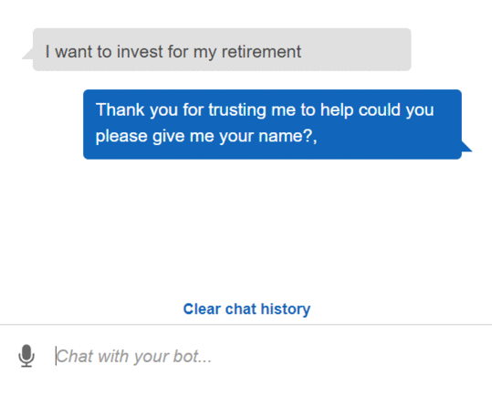
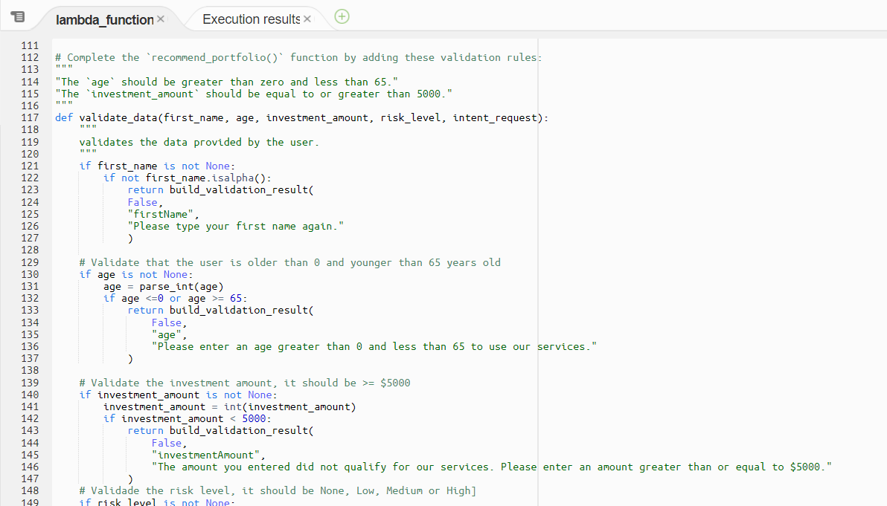
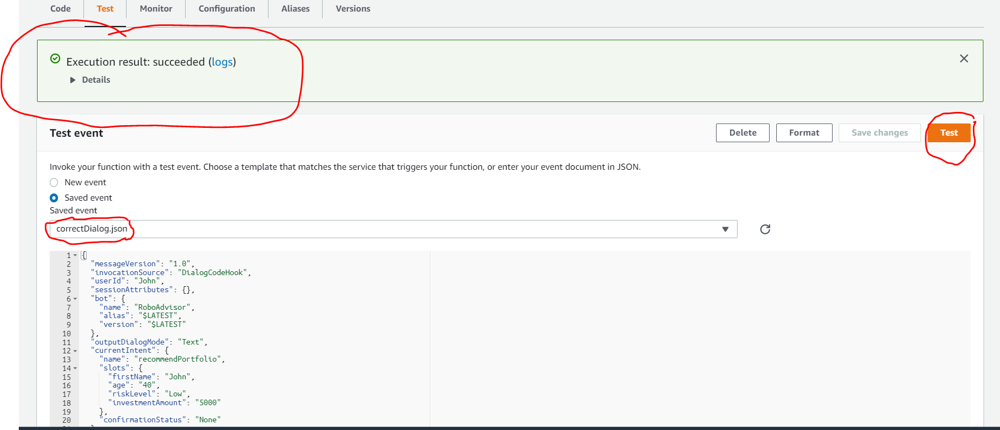
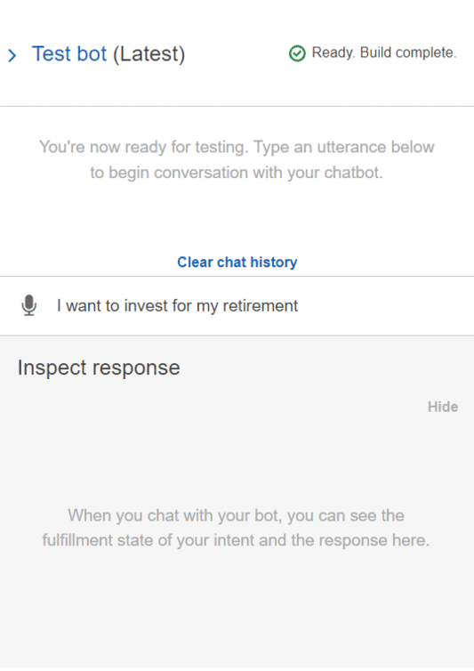

<!-- header is made with: https://github.com/kyechan99/capsule-render -->

[John Sung](https://linkedin.com/in/john-sung-3675569) 

                                                             
 
Columbia FinTech Bootcamp Assignment - Module 15

---

### Table of Contents

* [Overview](#overview)
* [Requirements](#requirements)
* [Instructions](#instructions)
* [Images and Demos](#images-and-demos)
* [License](#license)

---

## Overview

Using AWS Lex, RoboAdvisor was created and designed for clients searching for guidance towards their retirement. 

---

## Requirements

This project leverages **[python version 3.7](https://www.python.org/downloads/)** with the following packages and modules:

* [datetime](https://docs.python.org/3/library/datetime.html) - The datetime module supplies classes for manipulating dates and times.

* [dateutil](https://dateutil.readthedocs.io/en/stable/index.html) - powerful extensions to datetime by | pip install python-dateutil    

* [Create and Activate an AWS Account](https://aws.amazon.com/what-is-aws/)
    1) Create your account
    2) Add a payment method
    3) Verify your phone number
    4) Choose an AWS support plan

* [AWS Lex](https://aws.amazon.com/lex/) - Builds chatbots with conversational AI.

* [AWS Lambda](https://aws.amazon.com/lambda/) - Runs code without thinking about servers or clusters.

---

## Instructions

- ### Configure the initial robo advisor
    - Sign in to your AWS Management Console, and then create a new custom Amazon Lex bot
- ### Build and test the robo advisor
    - Test the RoboAdvisor using downloaded Test Events
- ### Enhance the robo advisor with an Amazon Lambda function
    - Download and use Lambda Function called lambda_function.py
---

## Images and Demos

### Test Bot
 

### Sample of validate_data function of Lambda Function code 
 

### Sample testing of lambda function code 
 

### Demo includes inputs errors to reflect false validation results and show correct information 
1. User will input or speak an utterance "I want to invest for my retirement"
2. User will then be asked for his first name. 
2. User will then be asked for their age. 
3. User will then be asked for the amount to invest.
4. User will then be asked for their risk tolerance.
5. User will then be provided their recommended investment allocation.
 

--- 

## License

### **MIT License**

Copyright (c) 2021 John Sung

Permission is hereby granted, free of charge, to any person obtaining a copy
of this software and associated documentation files (the "Software"), to deal
in the Software without restriction, including without limitation the rights
to use, copy, modify, merge, publish, distribute, sublicense, and/or sell
copies of the Software, and to permit persons to whom the Software is
furnished to do so, subject to the following conditions:

The above copyright notice and this permission notice shall be included in all
copies or substantial portions of the Software.

THE SOFTWARE IS PROVIDED "AS IS", WITHOUT WARRANTY OF ANY KIND, EXPRESS OR
IMPLIED, INCLUDING BUT NOT LIMITED TO THE WARRANTIES OF MERCHANTABILITY,
FITNESS FOR A PARTICULAR PURPOSE AND NONINFRINGEMENT. IN NO EVENT SHALL THE
AUTHORS OR COPYRIGHT HOLDERS BE LIABLE FOR ANY CLAIM, DAMAGES OR OTHER
LIABILITY, WHETHER IN AN ACTION OF CONTRACT, TORT OR OTHERWISE, ARISING FROM,
OUT OF OR IN CONNECTION WITH THE SOFTWARE OR THE USE OR OTHER DEALINGS IN THE
SOFTWARE

---
