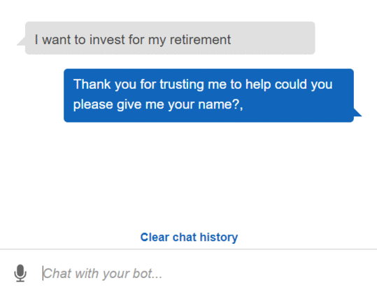

<!-- header is made with: https://github.com/kyechan99/capsule-render -->

[John Sung](https://linkedin.com/in/john-sung-3675569) 

                                                             
 
Columbia FinTech Bootcamp Assignment - Module 15

---

### Table of Contents

* [Overview](#overview)
* [Requirements](#requirements)
* [Data](#data)
* [Evaluation Report](#evaluation-report)
* [License](#license)

---

## Overview

Using AWS Lex, RoboAdvisor was created and designed for clients searching for guidance towards their retirement. 

---

## Requirements

This project leverages **[python version 3.7](https://www.python.org/downloads/)** with the following packages and modules:

* [datetime](https://docs.python.org/3/library/datetime.html)

* [dateutil](https://dateutil.readthedocs.io/en/stable/index.html)

* [AWS Lex](https://aws.amazon.com/lex/) - A service for building conversational interfaces into any application using voice and text. This was used in combination with the functionality created on AWS Lambda.

* [AWS Lambda](https://aws.amazon.com/lambda/) - To build the functionality for the tool.

---

## Data

The data used in this neural network model was from derived from a CSV file called emerging_markets_ohlcv.csv:

---

## Installation Guide

### 1. Create [AWS](https://aws.amazon.com/) free account to access AWS Lambda and AWS Lex. 

### 2. Use VSCODE to view and edit lambda_function.py file.

---
## Examples

Here are some of the data we did for this model.

### **This gif should show both correct and incorrect chatbot prompts:** 

---

## Usage

### To use the AWS Lambda function:

1. Go to AWS Lambda first. Create a new Lambda function from scratch, and name it recommendPortfolio. Choose Python 3.7 as the runtime programming language.

2. In the online code editor, delete the AWS-generated default lines of code, and then paste the new lambda_function.py that is provided with this file. 

---
### To use the AWS Lex Chatbot, our RoboAdvisor Investment Recommendation:

1. The user needs to input an utterance first i.e *"I want to invest for my retirement"*, then it will prompt to input his/her first name.
2. Then, it will ask for your age. Your age needs to be below the retirement age. 
3. Then, it will ask how much amount you want to invest, which needs to be at least $5,000.
4. Then, it will ask how much risk you can handle i.e none, low, medium or high.
5. Then, once you make a confirmation to proceed, it will share you your potential investment recommendation.

### **This shows just the correct chatbot prompts:**

---

## License

### **MIT License**

---
